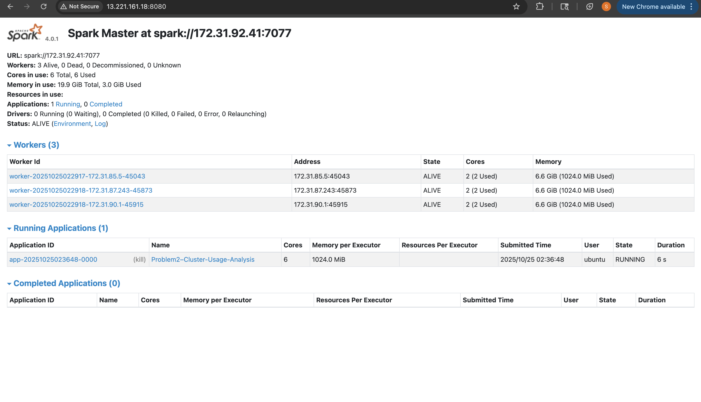

# ANALYSIS REPORT

## Problem 1 — Log Level Distribution

### Approach
To analyze the frequency of different Spark log levels, I used PySpark to load all container logs and extract their severity levels using keyword matching (`ERROR`, `WARN`, `INFO`, and `DEBUG`). The script first globbed all matching `container_*.log` files from the `data/raw/` directory, then converted them into a Spark DataFrame and counted the occurrences of each log level.

### Key Insights
- The vast majority of messages were `INFO`, which is expected since Spark logs routine execution progress at `INFO` level.
- `ERROR` and `WARN` were comparatively rare, suggesting that most cluster executions were stable and not encountering critical runtime issues.
- DEBUG-level logs were minimal, which likely reflects default Spark logging configuration rather than actual debugging activity.

---

## Problem 2 — Cluster Usage Analysis

### Approach
This part focused on understanding how often different clusters were used and how long applications ran on them. The analysis extracted application start and end timestamps from the logs and grouped them by cluster ID. From this we created:
1. A **timeline dataset** (`problem2_timeline.csv`)
2. A **cluster-level summary** (`problem2_cluster_summary.csv`)
3. A **global statistics summary** (`problem2_stats.txt`)
4. Visualizations (bar chart + duration density plot)

### Key Findings
- There are **6 total clusters** referenced in the logs.
- A total of **193 applications** were executed.
- Cluster usage is extremely **skewed** — one cluster (`1485248649253`) dominates with **180+ applications**.
- Several clusters were used only a handful of times.

This strongly suggests that most workloads were routed to a “primary” or default cluster while others were used sparingly, possibly as overflow or dedicated pools.

### Visual Observations
- The bar chart clearly shows a **long-tail distribution** in cluster usage.
- The duration density plot (for the largest cluster) reveals that:
  - Most jobs complete in relatively short durations.
  - A few extremely long-running jobs stretch the distribution tail.
- This kind of “short jobs + a few long ones” heavy-tail pattern is typical in shared compute environments.

